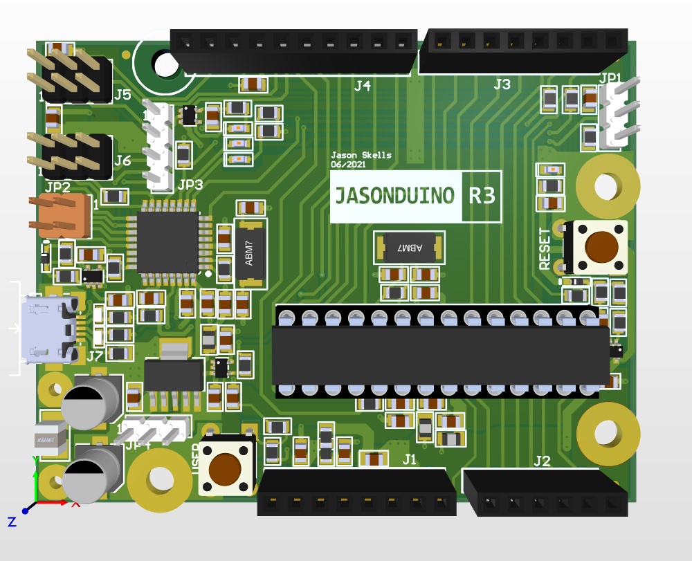
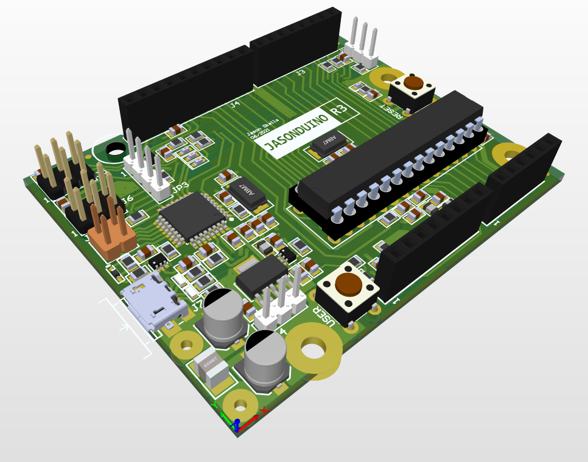
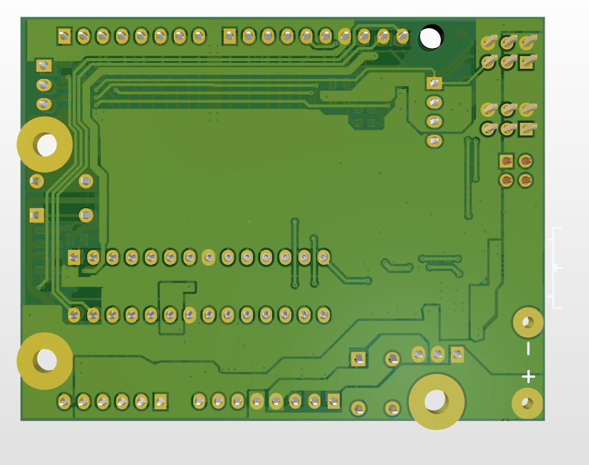
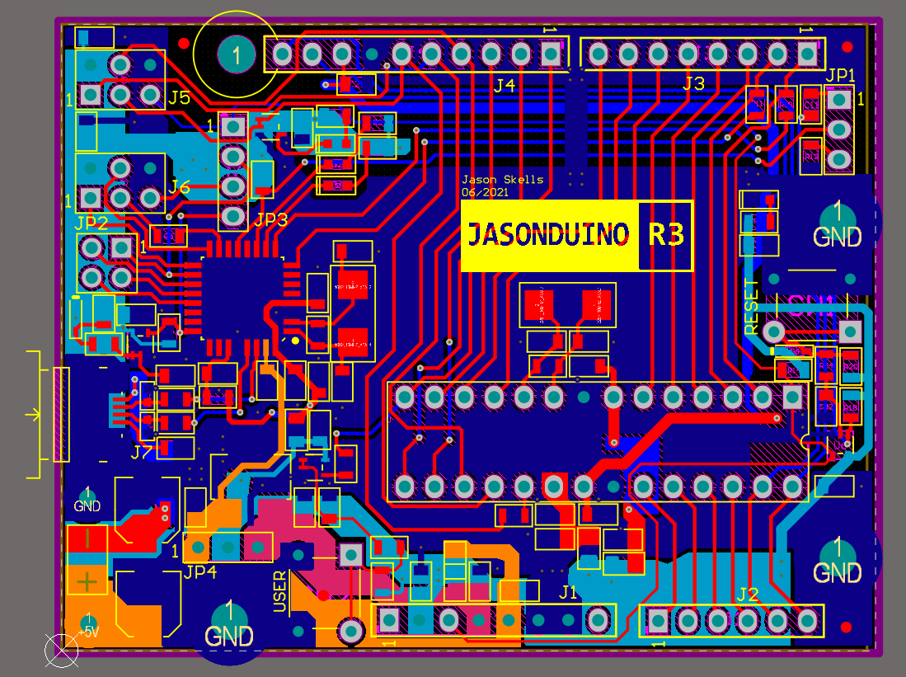
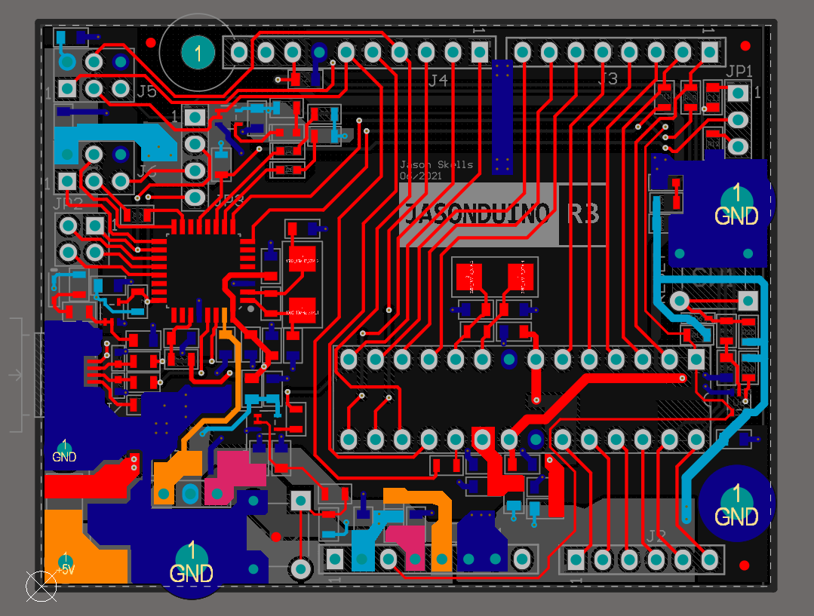
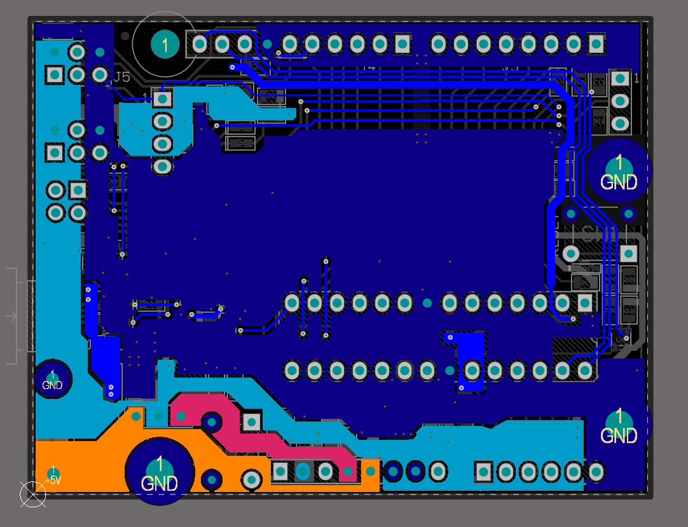

# jasonduino
This is my arduino clone, jasonduino. 

I did the schematic entry and PCB layout in Altium Designer.

Images of the Jasonduino - an Arduino clone based on the ATmega328
------------

# Top Side

# Isometric View

# Back Side

# Top Side in 2D

# Isolated Top Layer

# Isolated Bottom Layer

